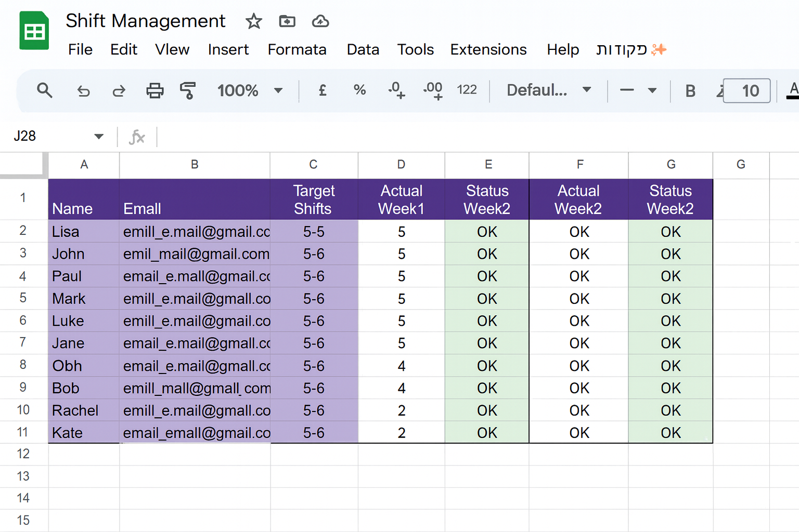
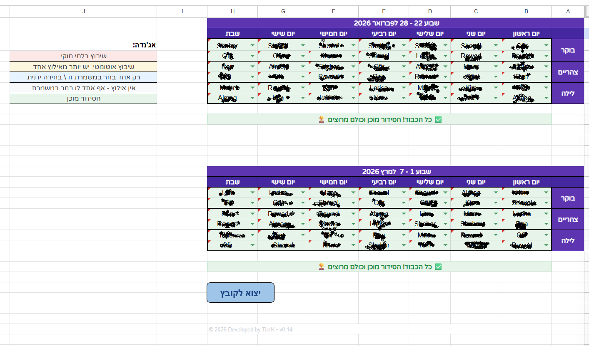
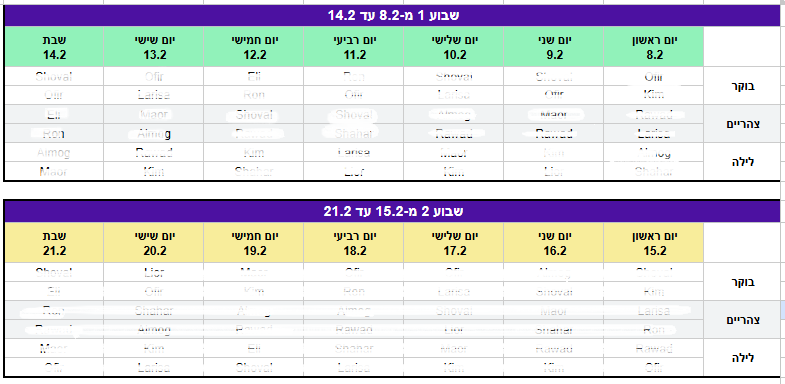
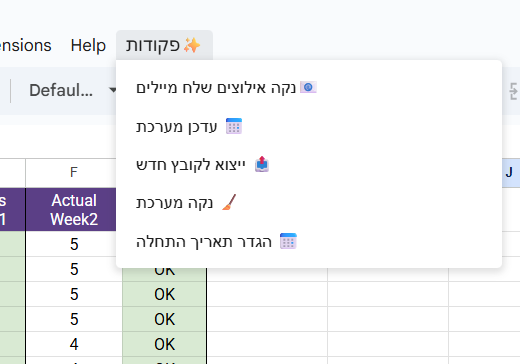
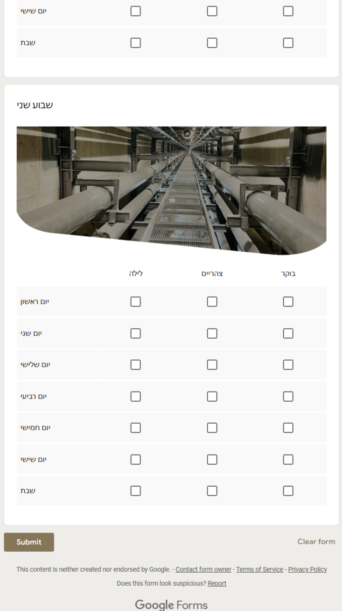
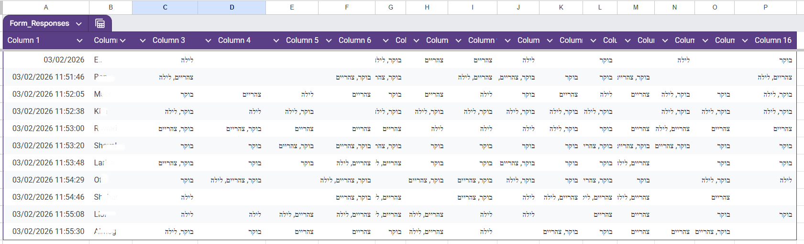
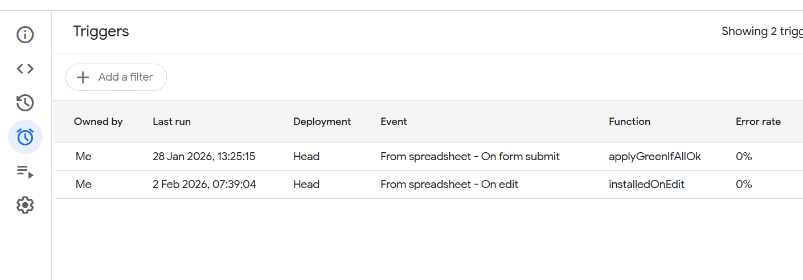

# ShiftEngine v0.14

**ShiftEngine** is a robust automation solution for managing 14-day shift cycles within Google Workspace. Designed for high-reliability environments, it handles everything from constraint collection to algorithmic assignment and dark-mode analytics.

[](https://opensource.org/licenses/MIT)
[](https://github.com/TierK)

---

## 🛠 Setup & Access
> ⚠️ **Note on SPREADSHEET_ID**: For security reasons, the Master Spreadsheet ID is not public. 
> To get the template and your unique ID, please [**Contact the Developer**](mailto:your-email@example.com?subject=ShiftEngine%20Access%20Request).

---

## 📸 System Overview

### 1. Management & Target Tracking
The system synchronizes with the `Staff` sheet to monitor shift targets vs. actual assignments.


### 2. Main Scheduling Interface
A 14-day grid featuring real-time validation logic and status indicators.


*Automated color coding for Week 1 and Week 2:*


### 3. Integrated Command Center (`פקודות✨`)
Custom UI menu providing direct access to the engine's core functions.


---

## 📝 Google Form & Response Structure

For the engine to process constraints correctly, the linked Google Form must follow a strict structure. The system maps the **User Interface (Form)** directly to the **Data Ingress (Sheet)**.

### 1. The Interface (Frontend)
* **Employee Name:** Must be a Dropdown or Short Answer that **exactly** matches the `Staff` sheet.
* **Grid/Checkboxes:** 14 separate questions for the 2-week cycle.
* **Allowed Values:** `בוקר` (Morning), `צהריים` (Afternoon), `לילה` (Night).



### 2. The Data Ingress (Backend)
The engine uses `cleanupDuplicateResponses()` to ensure that if an employee submits the form multiple times, only their **latest** submission is kept.


*Above: How the `Responses` sheet looks after successful synchronization.*

---

## 🛠 Technical Features

* **Smart Algorithm:** Prioritizes "Rare" availability and balances based on defined targets.
* **Invisible Markers:** Uses `\u200B` (Zero-width space) to distinguish between automated and manual entries.
* **Conflict Engine:** Detects double shifts and "Night-to-Morning" violations (rest time protection).
* **Dynamic Export:** Creates a standalone file with a unique color theme for every new export to maintain visual variety.
* **Dark Mode Analytics:** Full-scale dashboard including:
    * Workload Distribution (Pie Chart)
    * Night Shift Analytics (Purple Theme)
    * Shabbat Distribution (Gold Theme)


---

## ⚙️ DevOps & Deployment

### Required Triggers
For the automation to function correctly, the spreadsheet owner must manually set up the following triggers in the Apps Script console:



| Function | Event Source | Event Type | Description |
| :--- | :--- | :--- | :--- |
| `applyGreenIfAllOk` | From Spreadsheet | On form submit | Processes new constraints from Google Forms. |
| `installedOnEdit` | From Spreadsheet | On edit | Updates UI colors and conflict validation instantly. |

### Global Configuration
The system relies on a central `CONFIG` object. Note that the ID is abstracted for security.

```javascript
const CONFIG = {
  VERSION: "0.14",
  /** * SPREADSHEET_ID and FORM_URL are hidden for security. 
   * To request access or a template of SPREADSHEET or/end GOOGLE_FORM, contact: kimbfsd@gmail.com
   */
  SPREADSHEET_ID:'YOUR_ SPREADSHEET_ID',
  FORM_URL: 'YOUR_FORM_URL'
  // ... rest of config
};
````
## 📄 License
This project is licensed under the MIT License - see the [LICENSE](LICENSE) file for details.
