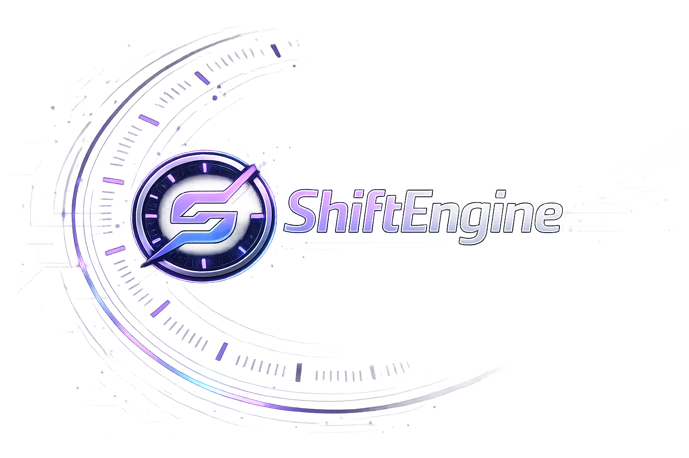
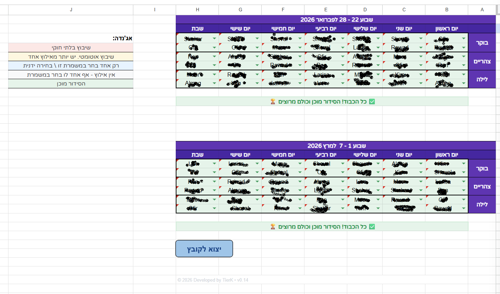
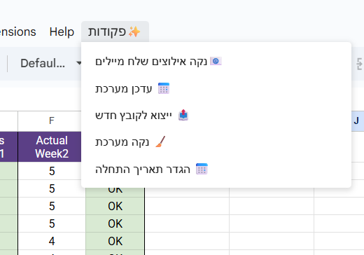
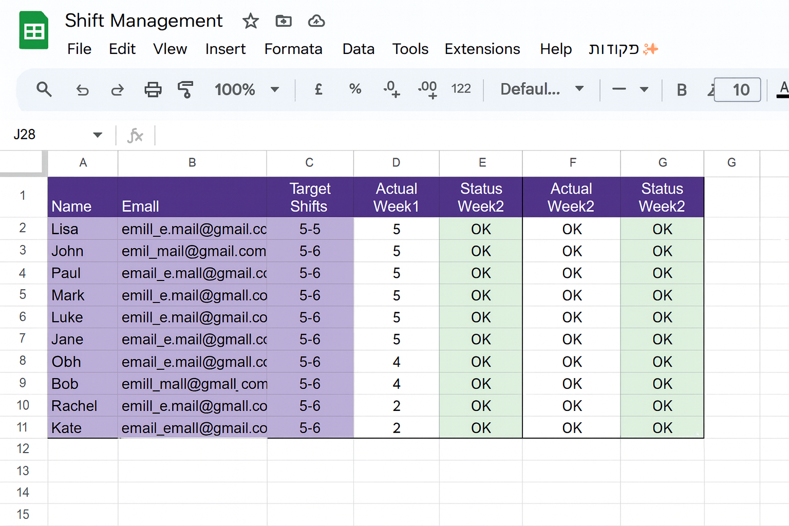
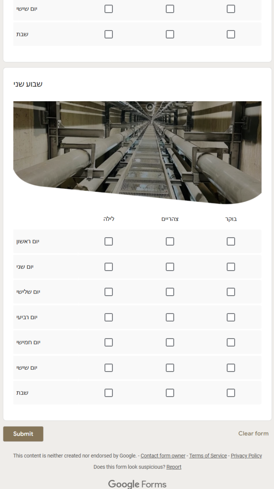

<p align="center">
  
</p>

<p align="center">
  <b>ShiftEngine — Intelligent Workforce Scheduling Platform</b>
</p>

<p align="center">
  Automate Scheduling. Eliminate Conflicts. Optimize Workforce.
</p>

<p align="center">
  <a href="https://opensource.org/licenses/MIT">
    
  </a>
  
  
</p>

---

## 🌟 The Problem

Manual shift planning is **time-consuming, error-prone**, and difficult to scale.  
Organizations face:

- Double-shift conflicts  
- Night → Morning violations  
- Imbalanced workloads  
- Poor visibility on assignments  

ShiftEngine solves these problems with an **automated, constraint-driven engine**.

---

## 🚀 Why ShiftEngine?

ShiftEngine is a **commercial-ready, constraint-aware scheduling engine** designed for:

- 📞 Call Centers & Customer Support  
- 🛡 Security & Dispatch Units  
- 🏥 Medical & Emergency Teams  
- 🏢 Enterprise Operations  

It provides **automation, analytics, and real-time conflict detection**, transforming workforce management into a predictable, optimized process.

---

## 🧩 Core Features

- **Constraint-Based Assignment**  
  Prioritizes rare availability and balances workload targets.

- **Conflict Prevention Engine**  
  Detects and prevents double shifts, rest-time violations, and night-to-morning errors.

- **Dynamic Analytics Dashboard**  
  Real-time visualization of workloads, night shifts, and Shabbat distribution.

- **Automated Exports**  
  Generates visually distinct schedule files with unique color themes.

- **Dark Mode Friendly**  
  Optimized UI for both light and dark environments.

- **Google Workspace Integration**  
  Works directly with Forms & Sheets, using event triggers and Apps Script automation.

---

## 🏗 System Architecture

ShiftEngine consists of 4 logical layers:

1. **Data Ingress Layer** – Google Forms → Responses cleanup  
2. **Validation Engine** – Rule enforcement & conflict detection  
3. **Assignment Core** – Rare availability & target balancing  
4. **Analytics & Export Layer** – Dashboard & themed exports  

**Flow Diagram:**

Google Form
⬇
Responses Sheet
⬇
ShiftEngine Core
⬇
Validation Engine
⬇
Final Schedule + Analytics Dashboard
⬇
Dynamic Exports

---

## 📸 Product Interface

### Main Scheduling Grid


### Analytics Dashboard


### Integrated Command Center


### Staff Configuration


### Google Form Interface


---

## 🛠 Deployment & Setup

1. Clone this repository:
```bash
git clone https://github.com/TierK/ShiftEngine.git
```

2. Install clasp (if not installed):
```bash
npm install -g @google/clasp
```

3. Authenticate Google account:
```bash
clasp login
```

4. Link project
```bash
{
  "scriptId": "YOUR_SCRIPT_ID",
  "rootDir": "."
}
```

5. Push code:
```bash
clasp push
```

## 🛠 Deployment & Setup

Set up triggers in Google Apps Script:

| Function | Event Source | Event Type | Description |
| :--- | :--- | :--- | :--- |
| applyGreenIfAllOk | From Spreadsheet | On form submit | Processes new constraints |
| installedOnEdit | From Spreadsheet | On edit | Updates UI colors & validation |

---

## 🛡 Security & Configuration

- `SPREADSHEET_ID` & `FORM_URL` are hidden for security.  
- To get your own deployment template, contact: **kimbfsd@gmail.com**

---

## 📈 Roadmap

- Multi-tenant SaaS architecture  
- Admin Panel with role-based permissions  
- REST API for integrations  
- React-based Web UI wrapper  
- Cloud database & multi-site support  

---

## 📄 License

MIT License – see [LICENSE](LICENSE)

---

<p align="center">
  
</p>

<p align="center">
  Built with 💜 by TierK
</p>